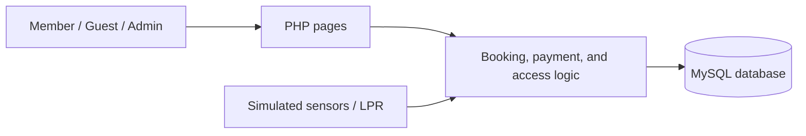

<div align="center">

# Cloud-Based Smart Parking System

PHP/MySQL coursework prototype for parking reservations, spot monitoring, role-based flows, and simulated payment.

[](https://www.php.net/)
[](https://www.mysql.com/)
[](#scope-and-limitations)

</div>

## Overview

The Smart Parking System (SPS) demonstrates a web-based parking workflow for three roles: members, guests, and administrators. It combines a PHP interface, a MySQL data model, and a complete set of analysis/design artifacts.

## Features

- Member and guest registration and sign-in flows
- Parking-space availability and reservation management
- Administrator views for users, bookings, payments, and spaces
- License-plate and sensor behavior represented as software simulations
- QR-code payment flow represented as a prototype
- UML documentation and database artifacts for the full system design

## Technology

| Layer | Technology |
| --- | --- |
| Interface | HTML, CSS, JavaScript |
| Server | PHP 8+ |
| Data | MySQL 8.x |
| Local runtime | Apache through XAMPP, WAMP, or LAMP |
| Modeling | PlantUML / Visual Paradigm artifacts |

## Quick start

1. Clone the repository into your web server document root.

   ```bash
   git clone https://github.com/YanYihann/Cloud-Based-Smart-Parking-System.git
   cd "Cloud-Based-Smart-Parking-System/Database & php"
   ```

2. Create a MySQL database named `CPS3962` and import the SQL file in `Database & php/database/`.
3. Configure the database connection in `Database & php/config/` for your local environment.
4. Start Apache and MySQL.
5. Open the project URL configured by your local server, for example `http://localhost/CPS3962/`.

Never commit real production credentials. Use a dedicated local database account where possible.

## Architecture



## Repository map

```text
Database & php/       PHP application, styles, images, configuration, and SQL
Diagrams/             UML analysis and design diagrams
Java code/            Supporting Java coursework artifacts
Database Structure.pdf
Report.pdf
```

## Scope and limitations

This is an academic prototype. Sensor input, license-plate recognition, and payments are demonstrations rather than production integrations. Before real deployment, add secure secret handling, password hashing review, server-side validation, CSRF protection, payment-provider integration, audit logging, and automated tests.

## License

No license file is currently included. Add one before inviting reuse or contributions.


